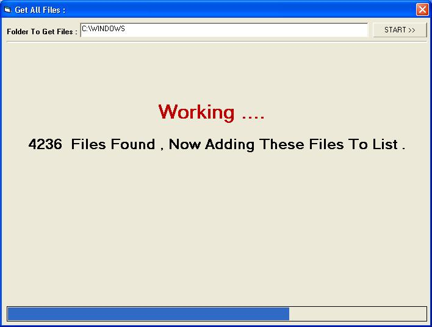



## Get All Files Located In Directory With Very Easy Way Including SubFolders

### Description

Hi All .. That's My First Upload To Planet . This Code Will Get All Files Located In Directory Including SubFolders .. It's Very Easy , Fast Way Without any APIS .. Just Copy The Function To Your Program and Use It .. That's an Example Program That Show's You How To Use Function .. Please Please , Send Me You Comments To My E-mail : la3toot@hotmail.com ; la3toot@yahoo.com .
 
### More Info
 

             |
---                |---
**Submitted On**   |2003-03-06 13:29:50
**By**             |[Abdalla Mahmoud](https://github.com/Planet-Source-Code/PSCIndex/blob/master/ByAuthor/abdalla-mahmoud.md)
**Level**          |Intermediate
**User Rating**    |4.0 (8 globes from 2 users)
**Compatibility**  |VB 6\.0
**Category**       |[Files/ File Controls/ Input/ Output](https://github.com/Planet-Source-Code/PSCIndex/blob/master/ByCategory/files-file-controls-input-output__1-3.md)
**World**          |[Visual Basic](https://github.com/Planet-Source-Code/PSCIndex/blob/master/ByWorld/visual-basic.md)
**Archive File**   |[Very\_Easy\_155638382003\.zip](https://github.com/Planet-Source-Code/abdalla-mahmoud-get-all-files-located-in-directory-with-very-easy-way-including-subfolders__1-43839/archive/master.zip)

